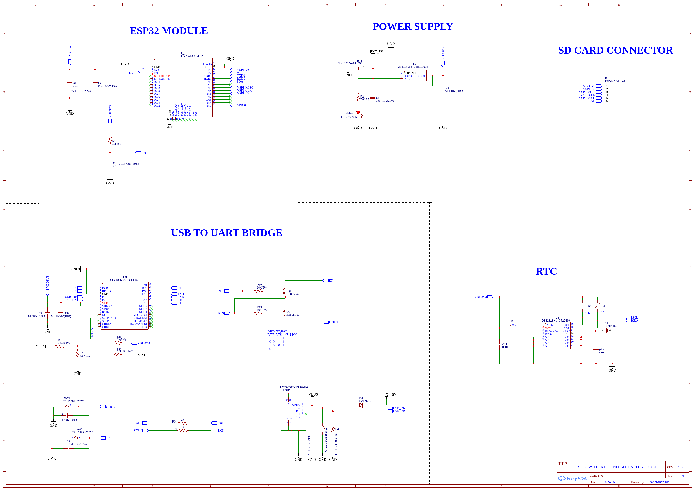
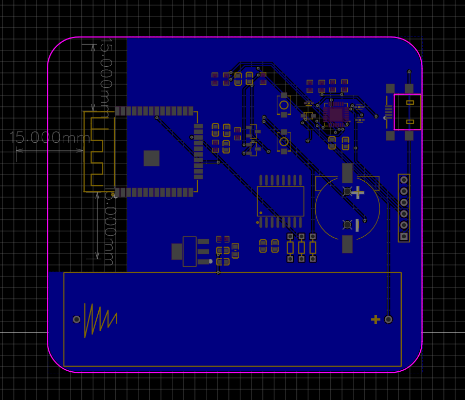
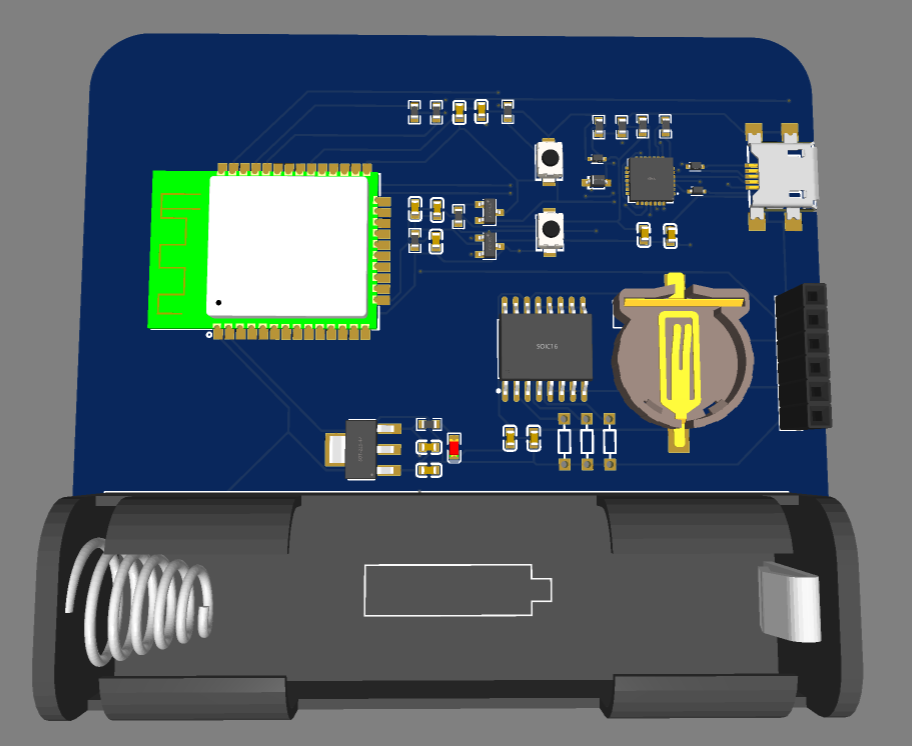
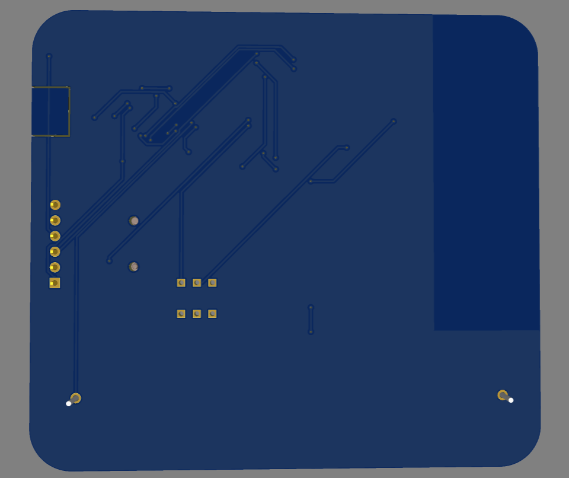

# ESP32 Data Logger Board with RTC and SD Card

> Designed by: Janardhan BV  
> Tool: EasyEDA  
> Revision: 1.0  
> Date: 2024-07-07

## Project Overview

This project is a compact **ESP32-based controller board** that combines wireless processing, USB programming, removable storage, and a battery-backed real-time clock on a single PCB. [file:147] It is structured around five clear hardware blocks in the schematic: **ESP32 module**, **power supply**, **USB-to-UART bridge**, **SD card connector**, and **RTC**. [file:147]

The board is suitable for applications such as IoT data logging, time-stamped sensor recording, edge monitoring, and embedded control where local storage and persistent timekeeping are required. [file:147]

## Key Features

- ESP32 module as the main controller with exposed programming and interface signals. [file:147]
- USB-to-UART bridge for firmware upload and serial debugging. [file:147]
- Auto-reset / auto-boot circuit using DTR and RTS so the ESP32 can enter bootloader mode during flashing without manual intervention. [file:147][web:41]
- Onboard 3.3V regulation using an **AMS1117-3.3** style power stage. [file:147][web:152]
- Dedicated SD card connector for local data logging. [file:147]
- Battery-backed RTC section for maintaining time when main power is removed. [file:147]

## Project Visuals

### Schematic

### PCB Layout

### 3D Board Top View

### 3D Board Bottom View
	

## Hardware Blocks

### ESP32 Module

The ESP32 section is the core compute block of the design and is connected to power, boot/reset control, serial programming lines, and external interfaces. [file:147] The schematic shows the usual EN and IO0 control needed for programming and startup behavior. [file:147]

### USB-to-UART Bridge

A CP2102-style USB-to-UART bridge is used to connect the board to a computer for code upload and serial communication. [file:147][web:156] The DTR and RTS signals are routed through a transistor-based auto-programming circuit, which matches the common ESP32 flashing method used by development boards. [file:147][web:41]

### Power Supply

The power section uses an AMS1117-3.3 regulator block with filtering components and indicator LED support to generate the main 3.3V rail for the board. [file:147][web:152] The schematic also shows external 5V input routing and USB power entry into the board power domain. [file:147]

### SD Card Interface

The SD card block provides a dedicated connector for removable storage, intended for logging files, measurement records, or configuration data. [file:147] This makes the board useful for standalone systems that must store data locally without a constant wireless connection. [file:147]

### RTC Section

The RTC portion includes an I2C clock device, support passives, and a backup coin-cell connection so time can be retained during power loss. [file:147] This allows the ESP32 to attach timestamps to measurements, events, or log files after reboot. [file:147]

## Programming and Boot Control

The programming section includes EN and IO0 control through the USB bridge handshake lines, which is the standard mechanism used for ESP32 automatic upload. [file:147][web:41] In typical ESP32 reset logic, DTR and RTS are toggled so EN is pulsed and IO0 is held low at the correct moment, forcing the chip into bootloader mode for flashing. [web:41]

## PCB Notes

The board layout reserves a large clear region around the RF side of the ESP32 module, which is good practice for antenna performance. [file:146][file:147] The design appears to be a compact two-layer board with short signal paths between the ESP32, USB bridge, RTC, and SD card sections. [file:146][file:147]

## Typical Applications

- IoT event logger. [file:147]
- Time-stamped sensor node. [file:147]
- Wi-Fi or Bluetooth data recorder with SD backup. [file:147]
- Compact controller board for embedded prototypes needing RTC and storage. [file:147]

## Bring-Up Checklist

1. Verify the 5V input rail before powering the ESP32 section. [file:147]
2. Confirm the AMS1117 output is a stable 3.3V. [file:147][web:152]
3. Check EN and IO0 behavior during USB flashing. [file:147][web:41]
4. Test serial communication through the USB-to-UART bridge. [file:147][web:156]
5. Verify RTC communication over I2C and confirm backup time retention. [file:147]
6. Insert an SD card and validate read/write operation from firmware. [file:147]

## Future Improvements

- Add clear silkscreen labels for all external headers. [file:146][file:147]
- Add test points for 5V, 3.3V, EN, IO0, TX, and RX. [file:147]
- Add ESD and surge review on the USB and external power input if the board will be used in field deployments. [file:147]
